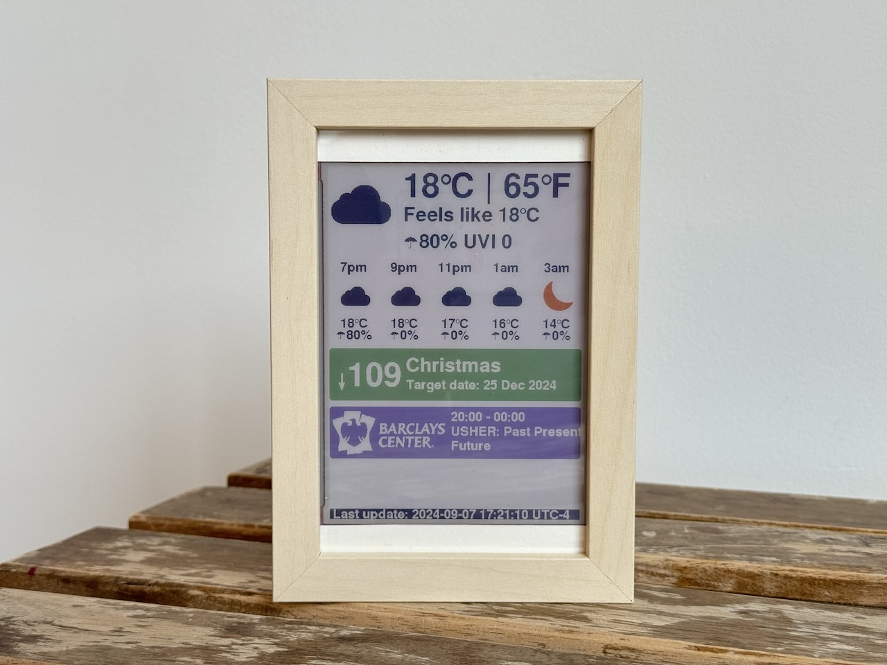

# ESP32 Info Dashboard
The **ESP32 Info Dashboard** is an information hub that provides all the essential details to kickstart my day. With a modular design, each component can be enabled or disabled independently, adapting to my evolving lifestyle. The 5.65" ePaper fits inside an IKEA photo frame and unobtrusively displays the information, blending perfectly into my living space.



### Modules
1. **Weather module** - Displays current weather conditions and a 10-hour forecast. Helps me decide whether to bring an umbrella or wear sunglasses. Data is obtained from OpenWeather API.
2. **Countdown module** - Keeps myself motivated by counting down to exciting events. This module adds a touch of anticipation and joy to your daily life.
3. **Barclays Center module** - I live close to Barclays Center, a large stadium in Brooklyn, NY. Staying informed about local events helps me plan my outings and avoid crowds. Information is sourced from Ticketmaster API.
4. **Custom Messages module** - Fetches personalized messages from my own server each time the display refreshes. No idea what to show yet, but it opens up endless possibilities for dynamic content generation on the server side without altering the Arduino code.

### Config file
The dashboard’s configuration can be updated on the fly by modifying the config API response from my server. This includes enabling/disabling modules, changing the weather location, updating the countdown target date, and adding dynamic messages to the custom messages module. The API response is generated using a PHP script but can also be a static file depending on the design. Below is a sample API response:

```
{
    "weather": {
        "location": {
            "lat": "40.6813",
            "lon": "-73.9762"
        },
        "showFahrenheit": true
    },
    "countdown": {
        "enable": true,
        "events": [
            {
                "eventName": "Christmas",
                "targetDateTs": 1735084800
            }
        ]
    },
    "barclays": {
        "enable": true
    },
    "customMessages": {
        "enable": false,
        "messages": [
            "my custom line1",
            "my custom line2"
        ]
    }
}
```

### To Do
1. Switch to WiFiManager for a web configuration portal for Wi-Fi credentials.
2. Stocks module - Need to find a good API.
3. Public transit module - Shows real-time arrival times for public transportation.

### Copyright
Iconset: ["The Weather is Nice Today"](https://www.iconfinder.com/iconsets/the-weather-is-nice-today) by [Laura Reen](https://www.iconfinder.com/laurareen) is licensed under [CC BY-NC 3.0](http://creativecommons.org/licenses/by-nc/3.0)
Iconset: 

BARCLAYS CENTER® is a registered trademark of BARCLAYS PLC.